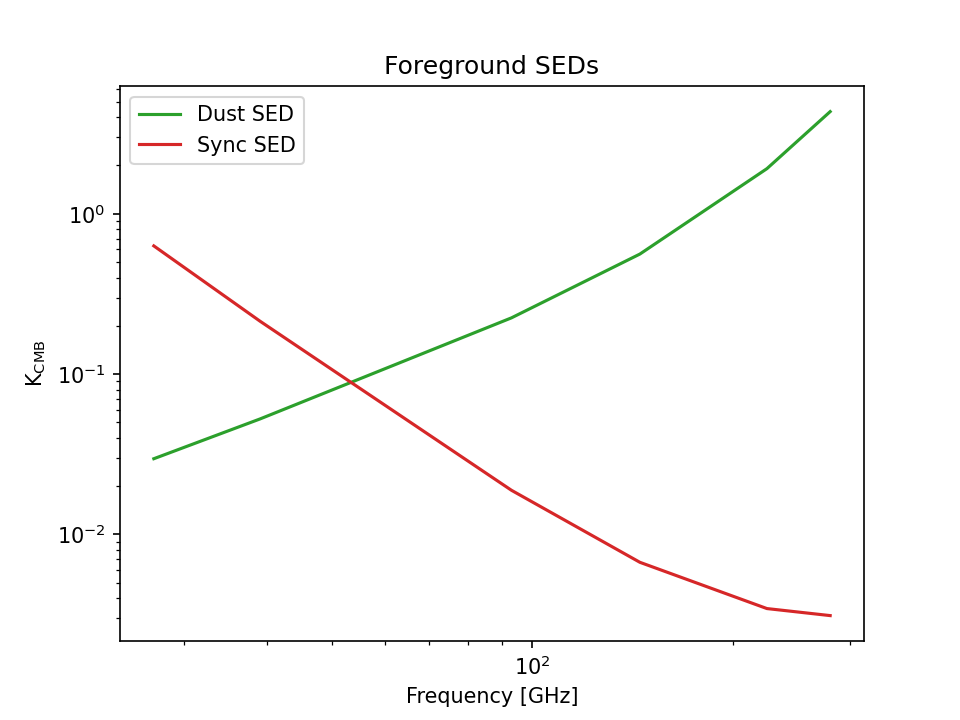
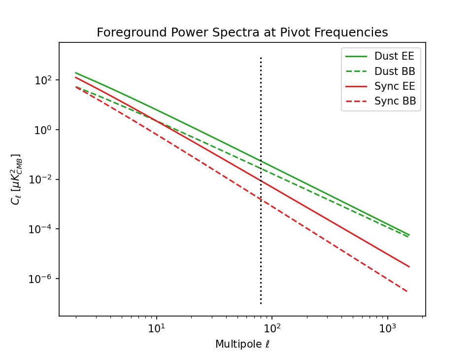
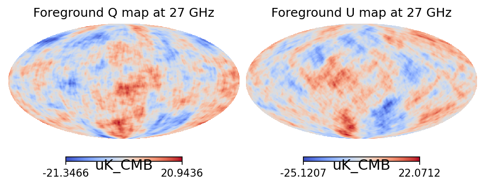
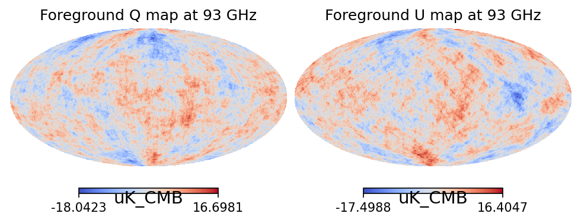
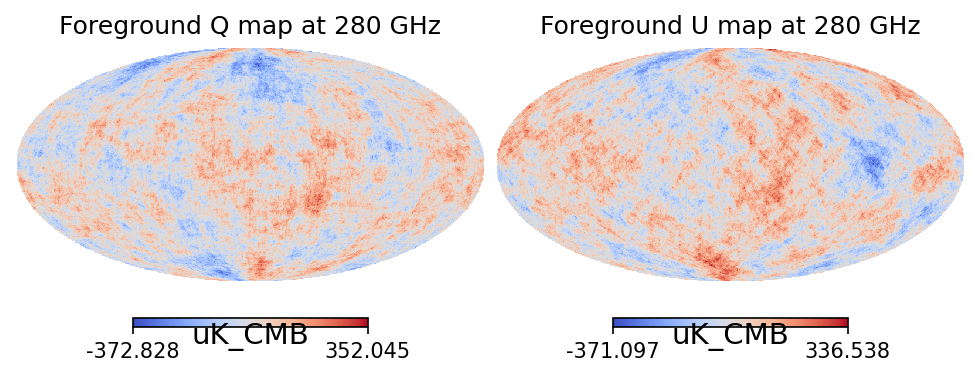
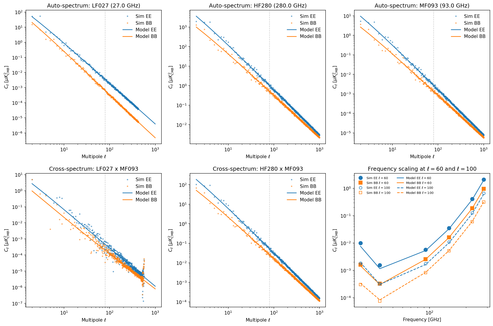

# Gaussian Foreground Simulations for Simons Observatory

This repository contains code to generate Gaussian realizations of polarized foreground maps (dust + synchrotron) for Simons Observatory (SO) frequency channels. The foreground model is based on [Wolz et al. 2024](https://doi.org/10.1051/0004-6361/202346105).

## Foreground Model

### Power Spectrum Model

The polarized foreground power spectra for dust and synchrotron are modeled as power laws in multipole $\ell$:

$$
D_\ell^{XY} = A_{XY} \left( \frac{\ell}{80} \right)^{\alpha_{XY}}
$$

where $D_\ell = \ell(\ell+1)C_\ell / 2\pi$, $XY \in \{EE, BB\}$, and $A_{XY}$ is the amplitude at the pivot multipole $\ell_0 = 80$.

The $C_\ell$ power spectra are therefore:

$$
C_\ell^{XY} = \frac{2\pi}{\ell(\ell+1)} A_{XY} \left( \frac{\ell}{80} \right)^{\alpha_{XY}}
$$

### Frequency Scaling

#### Dust Emission

Dust emission follows a modified blackbody (MBB) spectrum. The scaling from the pivot frequency $\nu_0^d = 353$ GHz to frequency $\nu$ in CMB temperature units is:

$$
f_d(\nu) = \frac{B_\nu(T_d)}{B_{\nu_0}(T_d)} \left( \frac{\nu}{\nu_0^d} \right)^{\beta_d - 2} \times \frac{U(\nu_0^d)}{U(\nu)}
$$

where:
- $B_\nu(T)$ is the Planck function
- $T_d$ is the dust temperature
- $\beta_d$ is the dust spectral index (following Planck 2018 XI convention with $\beta_d - 2$ for MBB in antenna temperature units)
- $U(\nu) = \frac{\partial B_\nu}{\partial T}\big|_{T_{CMB}}$ is the unit conversion factor from brightness temperature to CMB thermodynamic temperature

This is implemented using `skytools.greybody()` for the MBB and `skytools.KCMB_to_MJysr()` / `skytools.MJysr_to_Kb()` for unit conversions.

#### Synchrotron Emission

Synchrotron emission follows a power-law spectrum:

$$
f_s(\nu) = \left( \frac{\nu}{\nu_0^s} \right)^{\beta_s} \times \frac{U(\nu_0^s)}{U(\nu)}
$$

where $\nu_0^s = 23$ GHz is the synchrotron pivot frequency and $\beta_s$ is the synchrotron spectral index.

This is implemented using `skytools.powerlaw()` for the power-law scaling.

### Total Foreground Power Spectrum

The total foreground auto-spectrum at frequency $\nu$ is:

$$
C_\ell^{XY}(\nu) = f_d^2(\nu) \, C_\ell^{d,XY} + f_s^2(\nu) \, C_\ell^{s,XY}
$$

For cross-spectra between frequencies $\nu_1$ and $\nu_2$:

$$
C_\ell^{XY}(\nu_1 \times \nu_2) = f_d(\nu_1) f_d(\nu_2) \, C_\ell^{d,XY} + f_s(\nu_1) f_s(\nu_2) \, C_\ell^{s,XY}
$$

## Foreground Parameters

The default foreground parameters (from Wolz et al. 2024) are:

### Dust Parameters

| Parameter | Symbol | Value | Units |
|-----------|--------|-------|-------|
| EE Amplitude | $A_d^{EE}$ | 56 | $\mu K_{CMB}^2$ |
| BB Amplitude | $A_d^{BB}$ | 28 | $\mu K_{CMB}^2$ |
| EE Spectral Index | $\alpha_d^{EE}$ | -0.32 | — |
| BB Spectral Index | $\alpha_d^{BB}$ | -0.16 | — |
| Pivot Frequency | $\nu_0^d$ | 353 | GHz |
| MBB Spectral Index | $\beta_d$ | 1.54 | — |
| Dust Temperature | $T_d$ | 20 | K |

### Synchrotron Parameters

| Parameter | Symbol | Value | Units |
|-----------|--------|-------|-------|
| EE Amplitude | $A_s^{EE}$ | 9.0 | $\mu K_{CMB}^2$ |
| BB Amplitude | $A_s^{BB}$ | 1.6 | $\mu K_{CMB}^2$ |
| EE Spectral Index | $\alpha_s^{EE}$ | -0.7 | — |
| BB Spectral Index | $\alpha_s^{BB}$ | -0.93 | — |
| Pivot Frequency | $\nu_0^s$ | 23 | GHz |
| Power-law Index | $\beta_s$ | -3.0 | — |

## Spectral Energy Distributions

The dust and synchrotron SEDs across SO frequencies show characteristic behavior:



- **Dust** (green): Rising steeply toward higher frequencies, dominant at 225 and 280 GHz
- **Synchrotron** (orange): Falling toward higher frequencies, dominant at 27 and 39 GHz

## Power Spectra at Pivot Frequencies

The EE and BB power spectra at the dust (353 GHz) and synchrotron (23 GHz) pivot frequencies:



- Dust has higher amplitude than synchrotron at their respective pivots
- BB is roughly half the amplitude of EE for both components
- The different spectral indices cause the EE/BB ratio to vary with $\ell$

## Simulation Pipeline

### Overview

The simulation generates correlated multi-frequency foreground maps by:

1. Drawing Gaussian realizations of E-mode and B-mode alms at the pivot frequencies
2. Scaling these alms to each observation frequency using the SEDs
3. Applying Gaussian beam smoothing
4. Converting from harmonic to map space

### Key Functions in `GaussianForegroundSimulator`

#### `dust_cl()` / `sync_cl()`
Compute the dust and synchrotron $C_\ell^{EE}$ and $C_\ell^{BB}$ power spectra at the pivot frequencies.

```python
cl_dust_EE[2:] = A_dust_EE * (ells[2:] / 80.) ** alpha_dust_EE
cl_dust_EE[2:] /= Dell_factor[2:]  # Convert D_ell to C_ell
```

#### `dust_scaling(freq)` / `sync_scaling(freq)`
Compute the frequency scaling factors $f_d(\nu)$ and $f_s(\nu)$.

```python
def dust_scaling(self, freq):
    U = st.KCMB_to_MJysr(freq) * st.MJysr_to_Kb(freq)
    return st.greybody(freq, self.freq_piv_dust, self.beta_dust - 2., self.T_dust) / U
```

#### `dust_alms_at_pivot()` / `sync_alms_at_pivot()`
Generate Gaussian random alms from the power spectra using `healpy.synalm()`.

```python
alms_d_EE = hp.synalm(self.cl_dust_EE, lmax=self.lmax)
alms_d_BB = hp.synalm(self.cl_dust_BB, lmax=self.lmax)
```

#### `generate_fg_map(freq, beam_fwhm, nside, ...)`
Generate Q and U maps at a given frequency:

1. Scale the pivot alms by the SED factors
2. Apply Gaussian beam smoothing
3. Convert E/B alms to Q/U maps using spin-2 transform

```python
alms_fg_EE = dust_scale * alms_d_EE + sync_scale * alms_s_EE
alms_fg_BB = dust_scale * alms_d_BB + sync_scale * alms_s_BB

bl = hp.gauss_beam(np.deg2rad(beam_fwhm / 60.), lmax=self.lmax, pol=True)
alms_fg_EE = hp.almxfl(alms_fg_EE, bl[:, 1])
alms_fg_BB = hp.almxfl(alms_fg_BB, bl[:, 2])

fg_map_Q, fg_map_U = hp.alm2map_spin([alms_fg_EE, alms_fg_BB], nside, 2, lmax=self.lmax)
```

#### `generate_simulation(sim_idx, output_dir)`
Generate a complete simulation:
1. Set random seed for reproducibility: `np.random.seed(112359 + sim_idx)`
2. Generate pivot alms (one realization shared across all frequencies)
3. Loop over frequency channels, generating and saving maps

#### `run_simulations(n_sims, output_dir)`
Run multiple simulations with progress tracking.

### Output Format

Maps are saved as FITS files with naming convention:
```
sobs_gaussfg_{channel}_mc{sim_idx:03d}_nside{nside:04d}.fits
```

Each file contains:
- Field 0: T map (zeros)
- Field 1: Q map
- Field 2: U map

FITS headers include:
- `UNITS`: 'uK_CMB'
- `CHANNEL`: Channel name (e.g., 'MF093')
- `FREQ`: Frequency in GHz
- `BEAM`: Beam FWHM in arcmin
- `SIMIDX`: Simulation index

## Example Foreground Maps

### Low Frequency (27 GHz) — Synchrotron Dominated



### Mid Frequency (93 GHz) — Mixed



### High Frequency (280 GHz) — Dust Dominated



## Validation

The validation script (`validate_fg_sims.py`) performs comprehensive checks to ensure the simulated maps have the correct statistical properties.

### Validation Procedure

1. **Load simulated maps** for lowest, middle (93 GHz), and highest frequency channels

2. **Compute auto-spectra** using `healpy.anafast()` with pixel weights for accurate power spectrum estimation

3. **Compute cross-spectra** between:
   - Lowest frequency × 93 GHz
   - Highest frequency × 93 GHz

4. **Debeam the spectra**: Divide by the beam window function $B_\ell^2$ to recover the underlying power spectrum:
   $$
   \hat{C}_\ell^{debeam} = \frac{\hat{C}_\ell^{map}}{B_\ell^2}
   $$

5. **Compare to model predictions** from `fg_cl_model()` which computes the expected $C_\ell$ analytically

6. **Check frequency scaling** at specific multipoles ($\ell = 60$ and $\ell = 100$) across all channels

### Validation Results



The validation figure shows:

- **Top row**: Auto-spectra at lowest (27 GHz), highest (280 GHz), and middle (93 GHz) frequencies
  - Points: Simulated (debeamed) power spectra
  - Lines: Model predictions
  - Good agreement validates the power spectrum shape and amplitude

- **Bottom left**: Cross-spectrum between lowest and 93 GHz
- **Bottom middle**: Cross-spectrum between highest and 93 GHz
  - Cross-spectra test that frequency correlations are correctly implemented

- **Bottom right**: Frequency scaling at $\ell = 60$ (filled) and $\ell = 100$ (open)
  - Tests that the SED scaling is correct across all channels
  - The characteristic "foreground minimum" around 70-100 GHz is visible

### Numerical Validation

The script also prints numerical ratios (simulation/model) at $\ell = 60$ and $\ell = 100$ for each channel. Values close to 1.0 indicate good agreement (cosmic variance causes ~10-20% scatter for single realizations).

## Usage

### Running Simulations

```bash
cd code
python run_simulations.py
```

Configuration is set at the top of `run_simulations.py`:
```python
FG_PARAMS = "../resources/config/fg_params.yaml"
INSTR_PARAMS = "../resources/config/instr_params_baseline_pessimistic.yaml"
N_SIMS = 100
OUTPUT_DIR = "../output/foreground_sims/gaussian_fg/"
```

### Running Validation

```bash
cd code
python validate_fg_sims.py
```

### Using as a Library

```python
from generate_gaussian_fg import GaussianForegroundSimulator

# With default parameters
sim = GaussianForegroundSimulator()

# With custom YAML configs
sim = GaussianForegroundSimulator(
    fg_params='path/to/fg_params.yaml',
    instr_params='path/to/instr_params.yaml'
)

# Generate simulations
sim.run_simulations(n_sims=100, output_dir='./output/')
```

## Dependencies

- `numpy`
- `healpy`
- `skytools`
- `matplotlib`
- `pyyaml`
- `tqdm`

## References

- Wolz et al. 2024 — Foreground model parameters
- Planck 2018 XI — Modified blackbody convention for dust
- HEALPix — Spherical harmonic transforms
